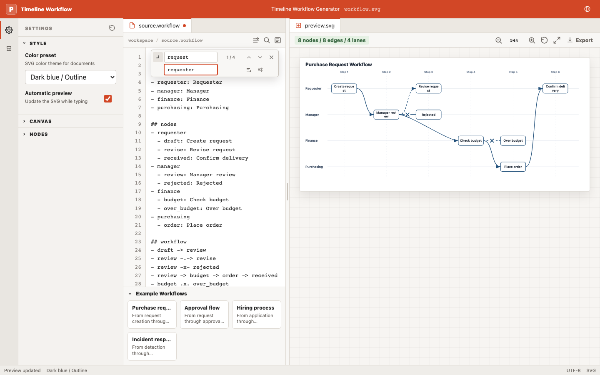

# Timeline Workflow Generator

English | [日本語](README.md)

A web application that generates lane-based timeline diagrams from dependency-based Markdown. It calculates each node's horizontal position from the dependency graph and exports editable PowerPoint, SVG, PNG, or a copied image.



## Features

- Declarative `## lanes`, `## nodes`, and `## workflow` syntax
- Automatic DAG-based timeline layout
- Solid, dotted, rejected, and invisible dependencies
- Editable PowerPoint shapes and connectors
- SVG / PNG download and image copy
- English and Japanese Web UI, examples, errors, and generated labels
- Live Markdown preview through the VS Code extension

## Getting Started

```bash
pnpm install
pnpm run dev
```

Run tests and build the application with:

```bash
pnpm test
pnpm run build
```

## Usage

1. Open the Engine.
2. Write workflow Markdown or paste a `workflow` code block.
3. Check the automatically aligned preview.
4. Export PPTX, SVG, or PNG, or copy the diagram as an image.
5. Edit the PPTX in PowerPoint or paste an image into your document.

## Workflow Example

````markdown
```workflow
# Purchase Request Workflow

## lanes
- requester: Requester
- manager: Manager
- finance: Finance

## nodes
- requester
  - draft: Create request
- manager
  - review: Review
- finance
  - budget: Check budget

## workflow
- draft -> review -> budget
```
````

See the [workflow syntax reference](docs/dsl.en.md) for the complete syntax, error examples, and PowerPoint workflow.

## VS Code Extension

Install [Timeline Workflow Preview](https://marketplace.visualstudio.com/items?itemName=zohiro00.timeline-workflow-preview) to preview the first `workflow` block in the active Markdown document while editing.

```bash
code --install-extension zohiro00.timeline-workflow-preview
```

The extension follows the VS Code display language in English and Japanese and reuses the same parser, layout engine, and SVG renderer as the Web application.

## Project Structure

- `src/workflow.js`: parser, DAG layout engine, and SVG renderer
- `src/main.js`: browser UI
- `vscode-extension/`: VS Code live preview extension
- `test/`: core and browser tests

## Development

Dependency management and scripts use pnpm. See [AGENTS.md](AGENTS.md) and [docs/development](docs/development/) before changing the project.
