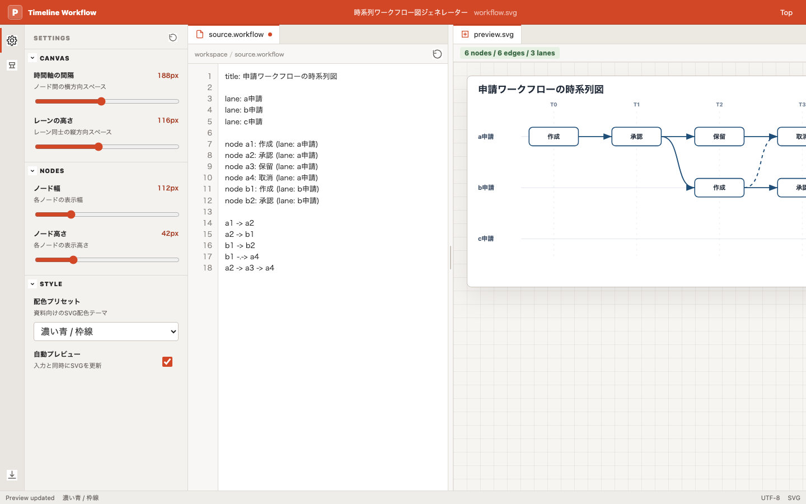

# 時系列ワークフロー図ジェネレーター

依存関係ベースでレーン型タイムラインSVGを生成するWebアプリです。Markdown内の `workflow` コードブロック、またはDSL本文を入力すると、ノードの依存関係から時間軸の `gridX` を自動計算してSVGを描画します。

ExcelやPowerPointで図形を並べる代わりに、作業、レーン、依存関係をテキストで書いて、資料に貼りやすいSVGを生成できます。稟議、申請、発注、障害対応、開発工程など、順序と担当レーンがある業務フローの下書きに向いています。



## Features

- `lane:`, `node`, `->`, `-.->` を使う宣言型DSL
- Markdown内の `workflow` コードブロック抽出
- DAGの最長経路法による時系列グリッド計算
- レーンと時間軸を固定したSVGレンダリング
- 同一レーンは直線、レーン跨ぎや逆行はCubic Bezierで描画
- Viteによるローカルプレビュー

## Getting Started

```bash
pnpm install
pnpm run dev
```

テスト:

```bash
pnpm test
```

ビルド:

```bash
pnpm run build
```

## Usage

1. Engineを開く
2. DSLを書く、またはMarkdown内の `workflow` コードブロックを貼り付ける
3. プレビューでレーン、時系列、依存関係を確認する
4. SVGをダウンロードする
5. PowerPointへドラッグ&ドロップする

## DSL Example

````markdown
```workflow
title: 申請ワークフローの時系列図

lane: a申請
lane: b申請
lane: c申請

node a1: 作成 (lane: a申請)
node a2: 承認 (lane: a申請)
node a3: 保留 (lane: a申請)
node a4: 取消 (lane: a申請)
node b1: 作成 (lane: b申請)
node b2: 承認 (lane: b申請)

a1 -> a2
a2 -> b1
b1 -> b2
b1 -.-> a4
a2 -> a3 -> a4
```
````

DSLの詳しい仕様、エラー例、PowerPointでの使い方は [docs/dsl.md](docs/dsl.md) を参照してください。

## Project Structure

- `src/workflow.js`: parser, DAG layout engine, SVG renderer
- `src/main.js`: browser UI
- `test/workflow.test.js`: parser/layout/rendering tests

## Later

VS Code拡張化を見据えて、コア処理はDOMに依存しない純粋なJavaScriptモジュールとして分離しています。
